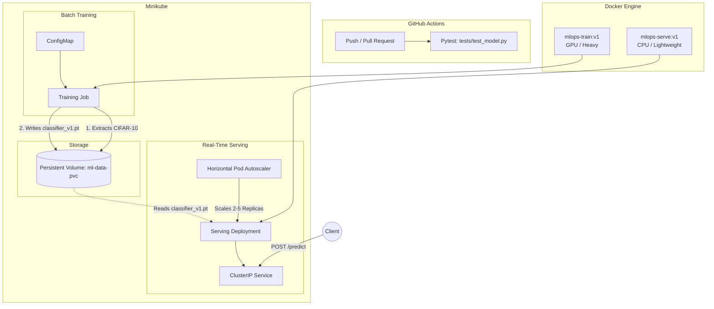

# MLOps PyTorch Pipeline

An end to end mlops pipeline that deploys a PyTorch image classification model (ResNet-18) through a complete deployment lifecycle from local development and Docker containerization to orchestrated training and autoscaled serving on Kubernetes has been implemented

## Architecture Diagram

This project utilizes a GPU-training and CPU-serving architecture. The following diagram illustrates the flow of data and resources within the Kubernetes cluster.




---

## Setup Instructions

### Prerequisites
* Docker Desktop installed and running
* Minikube and kubectl installed
* Python 3.11+ (for local testing)

### 1. Initialize Cluster & Build Images
To avoid massive image transfer times point your local terminal to Minikube's internal Docker daemon and build the images directly inside the cluster

```bash
# Start Minikube
minikube start

# Link terminal to Minikube's Docker daemon
eval $(minikube docker-env)

# Build the GPU-optimized training image
docker build -f docker/Dockerfile.train -t mlops-train:v1 .

# Build the CPU-optimized lightweight serving image
docker build -f docker/Dockerfile.serve -t mlops-serve:v1 .
```

### 2. Launch the Training Job
Deploy the storage, configuration, and batch job. The job will download the CIFAR-10 dataset train the ResNet-18 model for 10 epochs and save the weights to the persistent volume

```bash
# Apply infrastructure and training manifests
kubectl apply -f k8s/namespace.yaml
kubectl apply -f k8s/pvc.yaml
kubectl apply -f k8s/configmap.yaml
kubectl apply -f k8s/training-job.yaml

# Stream the training logs
kubectl logs -f job/pytorch-training-job -n ml-training
```

### 3. Deploy the Serving API
Once the training job logs indicate completion (`"event": "training_complete"`), deploy the FastAPI serving layer. This deployment mounts the volume as readOnly and utilizes an HPA to scale based on CPU utilization.

```bash
# Apply serving manifests
kubectl apply -f k8s/serving-deployment.yaml
kubectl apply -f k8s/serving-service.yaml
kubectl apply -f k8s/hpa.yaml

# Wait for the pods to become ready
kubectl get pods -n ml-training -w
```

### 4. Test the Pipeline
Forward the cluster service to your local machine and test the inference endpoint with a 32x32 image.

```bash
# Port-forward the API (run in a separate terminal or background)
kubectl port-forward svc/model-serving 8080:80 -n ml-training &

# Send a prediction request with the test image in repo
curl -X POST http://localhost:8080/predict -F "image=@airplane.jpg"
```

**Expected JSON Response:**
```json
{
  "prediction": "airplane",
  "probabilities": {
    "airplane": 0.9638,
    "automobile": 0.0001,
    "bird": 0.0323,
    "cat": 0.0034,
    "deer": 0.0002,
    "dog": 0.0,
    "frog": 0.0001,
    "horse": 0.0,
    "ship": 0.0001,
    "truck": 0.0
  }
}
```